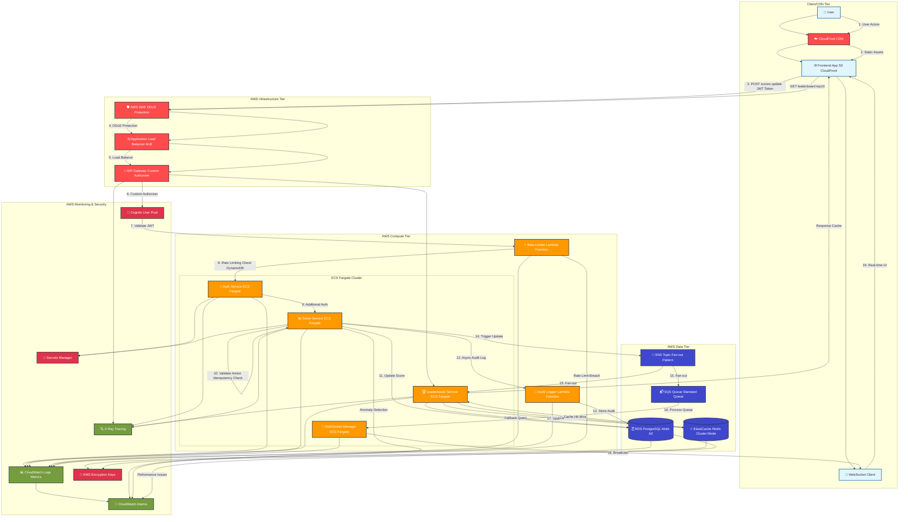

# Live Scoreboard API Module

## Overview

The Live Scoreboard API Module provides real-time score management and leaderboard functionality for web applications. It handles secure score updates, maintains a top 10 leaderboard, and broadcasts live updates to connected clients using WebSocket technology.

## Features

- **Real-time Updates**: Live scoreboard updates using WebSocket connections
- **Top 10 Leaderboard**: Maintains and serves the top 10 user scores
- **Secure Score Updates**: Protected API endpoints with authentication and authorization
- **Anti-fraud Protection**: Rate limiting, validation, and audit logging
- **Scalable Architecture**: Redis-backed caching and pub/sub for horizontal scaling

## AWS Architecture Components



### Frontend & CDN
- **CloudFront CDN**: Global content delivery and edge caching
- **S3 Static Website**: Frontend application hosting
- **AWS WAF**: DDoS protection and web application firewall

### API & Gateway Layer
- **API Gateway**: RESTful API management with custom authorizers
- **Application Load Balancer (ALB)**: Layer 7 load balancing
- **Cognoto User Pool**: User authentication and JWT token management

### Compute Services
- **ECS Fargate Cluster**: Containerized microservices
    - Score Service (Auto-scaling)
    - Leaderboard Service (Auto-scaling)
    - WebSocket Manager (Auto-scaling)
    - Authentication Service (Auto-scaling)
- **Lambda Functions**: Serverless components
    - Rate Limiter (Event-driven)
    - Audit Logger (Async processing)

### Data Services
- **RDS PostgreSQL (Multi-AZ)**: Primary database with high availability
- **ElastiCache Redis Cluster**: Distributed caching and pub/sub
- **SQS Standard Queue**: Reliable message queuing
- **SNS Topic**: Fan-out messaging pattern

### Security & Monitoring
- **CloudWatch**: Centralized logging and metrics
- **X-Ray**: Distributed tracing and performance analysis
- **CloudWatch Alarms**: Real-time alerting
- **Secrets Manager**: Secure credential storage
- **KMS**: Encryption key management

## API Endpoints

### 1. Update User Score
```
POST /api/v1/scores/update
```

**Headers:**
```
Authorization: Bearer <jwt_token>
Content-Type: application/json
```

**Request Body:**
```json
{
  "userId": "string",
  "actionType": "string",
  "actionId": "string",
  "timestamp": "ISO8601",
  "scoreIncrement": "number",
  "actionMetadata": {
    "sessionId": "string",
    "clientFingerprint": "string",
    "additionalData": "object"
  }
}
```

**Response (Success):**
```json
{
  "success": true,
  "data": {
    "userId": "string",
    "newScore": "number",
    "scoreIncrement": "number",
    "currentRank": "number",
    "actionId": "string"
  },
  "timestamp": "ISO8601"
}
```

**Response (Error):**
```json
{
  "success": false,
  "error": {
    "code": "string",
    "message": "string",
    "details": "object"
  },
  "timestamp": "ISO8601"
}
```

### 2. Get Current Leaderboard
```
GET /api/v1/leaderboard/top10
```

**Response:**
```json
{
  "success": true,
  "data": {
    "leaderboard": [
      {
        "rank": 1,
        "userId": "string",
        "username": "string",
        "score": "number",
        "lastUpdated": "ISO8601"
      }
    ],
    "lastUpdated": "ISO8601",
    "totalUsers": "number"
  }
}
```

### 3. WebSocket Connection
```
WS /api/v1/ws/leaderboard
```

**Connection Parameters:**
```
?token=<jwt_token>&clientId=<unique_client_id>
```

**Real-time Messages:**
```json
{
  "type": "LEADERBOARD_UPDATE",
  "data": {
    "leaderboard": [...],
    "changes": [
      {
        "userId": "string",
        "oldRank": "number",
        "newRank": "number",
        "scoreChange": "number"
      }
    ]
  },
  "timestamp": "ISO8601"
}
```

## Security Implementation

### Authentication & Authorization
1. **JWT Token Validation**: All requests must include valid JWT tokens
2. **User Permission Check**: Verify user can update their own score only
3. **Session Validation**: Cross-reference with active user sessions

### Anti-Fraud Measures
1. **Rate Limiting**:
    - Per user: 10 requests per minute
    - Per IP: 100 requests per minute
    - Per session: 50 requests per hour

2. **Action Validation**:
    - Unique action IDs to prevent replay attacks
    - Timestamp validation (actions must be within 5 minutes)
    - Score increment validation based on action type

3. **Anomaly Detection**:
    - Monitor unusual score patterns
    - Flag rapid successive updates
    - Track client fingerprinting inconsistencies

### Audit Logging
All score updates are logged with:
- User ID and session information
- Action details and metadata
- IP address and client fingerprint
- Timestamp and request headers
- Success/failure status

## Database Schema

### Users Table
```sql
CREATE TABLE users (
  id UUID PRIMARY KEY,
  username VARCHAR(50) UNIQUE NOT NULL,
  email VARCHAR(255) UNIQUE NOT NULL,
  total_score BIGINT DEFAULT 0,
  created_at TIMESTAMP DEFAULT NOW(),
  updated_at TIMESTAMP DEFAULT NOW()
);
```

### Score Actions Table
```sql
CREATE TABLE score_actions (
  id UUID PRIMARY KEY,
  user_id UUID REFERENCES users(id),
  action_id VARCHAR(255) UNIQUE NOT NULL,
  action_type VARCHAR(50) NOT NULL,
  score_increment INTEGER NOT NULL,
  client_fingerprint VARCHAR(255),
  session_id VARCHAR(255),
  ip_address INET,
  metadata JSONB,
  created_at TIMESTAMP DEFAULT NOW()
);
```

### Audit Logs Table
```sql
CREATE TABLE audit_logs (
  id UUID PRIMARY KEY,
  user_id UUID,
  action VARCHAR(50) NOT NULL,
  resource VARCHAR(100),
  details JSONB,
  ip_address INET,
  user_agent TEXT,
  success BOOLEAN,
  created_at TIMESTAMP DEFAULT NOW()
);
```

## Redis Schema

### Leaderboard Cache
```
Key: "leaderboard:top10"
Type: Sorted Set
TTL: 300 seconds (5 minutes)
```

### Rate Limiting
```
Key: "rate_limit:user:{userId}"
Key: "rate_limit:ip:{ipAddress}"
Key: "rate_limit:session:{sessionId}"
Type: String (counter)
TTL: Based on rate limit window
```

## AWS Deployment Configuration

### Infrastructure as Code (CloudFormation/CDK)
```yaml
# ECS Fargate Service Configuration
ScoreService:
  Type: AWS::ECS::Service
  Properties:
    Cluster: !Ref ECSCluster
    TaskDefinition: !Ref ScoreServiceTaskDef
    DesiredCount: 2
    LaunchType: FARGATE
    NetworkConfiguration:
      AwsvpcConfiguration:
        SecurityGroups: [!Ref ECSSecurityGroup]
        Subnets: [!Ref PrivateSubnet1, !Ref PrivateSubnet2]

# RDS PostgreSQL Configuration
Database:
  Type: AWS::RDS::DBInstance
  Properties:
    DBInstanceClass: db.r5.large
    Engine: postgres
    MultiAZ: true
    AllocatedStorage: 100
    StorageEncrypted: true
    KmsKeyId: !Ref DatabaseKMSKey

# ElastiCache Redis Configuration
RedisCluster:
  Type: AWS::ElastiCache::ReplicationGroup
  Properties:
    ReplicationGroupDescription: "Scoreboard Cache"
    NumCacheClusters: 3
    Engine: redis
    CacheNodeType: cache.r5.large
    TransitEncryptionEnabled: true
    AtRestEncryptionEnabled: true
```

### Environment Variables (AWS Systems Manager Parameter Store)
```env
# Database Configuration
/scoreboard/database/url=rds-endpoint
/scoreboard/database/username=stored-in-secrets-manager
/scoreboard/database/password=stored-in-secrets-manager

# Redis Configuration  
/scoreboard/redis/endpoint=elasticache-endpoint
/scoreboard/redis/port=6379

# Authentication
/scoreboard/cognito/user-pool-id=us-east-1_xxxxxxxxx
/scoreboard/cognito/client-id=xxxxxxxxxxxxxxxxxx
/scoreboard/jwt/issuer=https://cognito-idp.us-east-1.amazonaws.com/us-east-1_xxxxxxxxx

# Rate Limiting (DynamoDB Table)
/scoreboard/rate-limit/table-name=scoreboard-rate-limits
/scoreboard/rate-limit/user-per-minute=10
/scoreboard/rate-limit/ip-per-minute=100

# Monitoring
/scoreboard/cloudwatch/namespace=Scoreboard/Production
/scoreboard/xray/enabled=true
/scoreboard/log-level=INFO
```

## Error Codes

| Code | Message | Description |
|------|---------|-------------|
| `AUTH_001` | Invalid or expired token | JWT token is invalid or expired |
| `AUTH_002` | Insufficient permissions | User lacks permission for this action |
| `RATE_001` | Rate limit exceeded | Too many requests in time window |
| `VALID_001` | Invalid action ID | Action ID is malformed or duplicate |
| `VALID_002` | Invalid timestamp | Action timestamp is outside tolerance |
| `VALID_003` | Invalid score increment | Score increment exceeds maximum allowed |
| `SYS_001` | Database error | Internal database operation failed |
| `SYS_002` | Cache error | Redis operation failed |

## AWS Deployment & Operations

### Container Deployment (ECS Fargate)
```dockerfile
# Dockerfile for Score Service
FROM node:18-alpine
WORKDIR /app
COPY package*.json ./
RUN npm ci --only=production
COPY . .
EXPOSE 3000
CMD ["node", "src/index.js"]
```

### Auto Scaling Configuration
- **ECS Services**: Scale based on CPU/Memory utilization (2-10 instances)
- **RDS**: Read replicas for high-read workloads
- **ElastiCache**: Cluster mode with automatic failover
- **Lambda**: Concurrent execution limits and reserved capacity

### Monitoring & Alerting Setup
- **CloudWatch Dashboards**: Real-time metrics visualization
- **Custom Metrics**: Score update rates, leaderboard cache hit ratios
- **Alarms**: High error rates, database connection issues, memory usage
- **SNS Notifications**: Alert engineering team via email/Slack

### Security Best Practices
- **VPC Configuration**: Private subnets for backend services
- **Security Groups**: Least privilege access rules
- **IAM Roles**: Service-specific permissions with minimal access
- **Secrets Rotation**: Automatic database credential rotation
- **WAF Rules**: Protection against common web attacks

### Cost Optimization
- **Spot Instances**: Use for non-critical background processing
- **Reserved Instances**: RDS and ElastiCache reserved capacity
- **S3 Lifecycle**: Archive old audit logs to cheaper storage classes
- **CloudWatch Logs**: Retention policies to manage log storage costs

## Testing Strategy

### Unit Tests
- Score calculation logic
- Rate limiting algorithms
- Authentication middleware
- Data validation functions

### Integration Tests
- API endpoint functionality
- Database operations
- Redis caching
- WebSocket connections

### Load Testing
- Concurrent score updates
- WebSocket connection limits
- Rate limiting effectiveness
- Database performance under load

## Additional Improvements & Recommendations

### Performance Optimizations
1. **Database Indexing**: Add indexes on `users.total_score`, `score_actions.user_id`, and `score_actions.created_at`
2. **Connection Pooling**: Implement database connection pooling for better resource management
3. **Horizontal Scaling**: Use Redis Cluster for distributed caching and pub/sub
4. **CDN Integration**: Cache static leaderboard data at CDN edge locations

### Security Enhancements
1. **Advanced Fraud Detection**: Implement machine learning models to detect suspicious patterns
2. **IP Geolocation**: Track and validate user locations for additional security
3. **Device Fingerprinting**: Enhanced client fingerprinting for better user tracking
4. **Encrypted Communications**: Ensure all API communications use TLS 1.3

### Monitoring & Observability
1. **Distributed Tracing**: Implement OpenTelemetry for request tracing
2. **Custom Metrics**: Track business metrics like score distribution and user engagement
3. **Alerting**: Set up alerts for unusual score patterns and system anomalies
4. **Dashboard**: Create real-time dashboards for system health and business metrics

### Scalability Considerations
1. **Microservices**: Consider splitting into separate services for authentication, scoring, and leaderboards
2. **Event Sourcing**: Implement event sourcing for better audit trails and replay capabilities
3. **CQRS Pattern**: Separate read and write models for optimal performance
4. **Database Sharding**: Implement user-based sharding for massive scale

### User Experience
1. **Graceful Degradation**: Fallback mechanisms when real-time features are unavailable
2. **Offline Support**: Queue score updates when users are offline
3. **Progressive Loading**: Load leaderboard incrementally for better perceived performance
4. **Push Notifications**: Notify users of rank changes and achievements

### Compliance & Data Protection
1. **GDPR Compliance**: Implement user data deletion and export capabilities
2. **Data Retention**: Automated cleanup of old audit logs and user data
3. **Encryption at Rest**: Encrypt sensitive data in the database
4. **Privacy Controls**: Allow users to control their visibility on leaderboards
